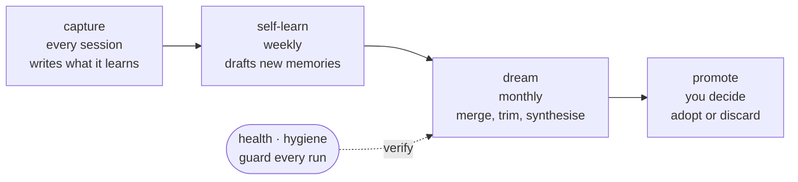

# dreaming

**Your AI agent learns all day. This is how it sleeps on it.**

Agents pile everything into a `MEMORY.md` until it rots: stale notes, duplicates, an index too big to load. The fix is not a bigger memory. It is consolidation on a schedule, the way sleep sorts a day into what is worth keeping.

Works with **any LLM** that has a CLI with file-edit and bash tools. Ships with a working Claude adapter and stub adapters for Codex, Gemini, Ollama, and raw OpenAI.



One night's sleep, on a schedule: **capture** what happened, **consolidate** it down, **curate** what survives. Two mechanical guards watch the cycle so it cannot quietly corrupt itself: `health` checks each dream followed its contract, `hygiene` catches the rot the loops cannot see.

---

## Why

Most agent setups have a memory problem. They append to a `MEMORY.md`, drift accumulates, files get stale, duplicates pile up, and the agent eventually loses the thread of what it knows. The fix is not "bigger context", it is **scheduled consolidation**, the way humans dream.

`dreaming` runs four loops:

| Loop | Cadence | What it does |
|---|---|---|
| **capture** | every session | Sessions write learnings to project memory dirs. No action needed — your existing agent setup already does this. |
| **self-learn** | weekly | Scans recent session transcripts, drafts new memory files, stages them for review. Promotion-only — no merging or trimming. |
| **dream** | monthly | Deep consolidation. Reads all memory, merges duplicates, trims stale, synthesises principles, surfaces skill gaps. Snapshot before, full rollback. |
| **promote** | manual | Review-and-adopt step. Stages → live with explicit confirmation. Default mode is dry-run; `--commit` to actually apply. |

Plus a **fitness function** (`dreaming health`) that mechanically verifies every dream run followed the contract, catching prompt drift before it corrupts memory, and a **memory linter** (`dreaming hygiene`) that catches the rot the loops cannot see: memories written but never indexed, indexes pointing at files that have gone, and an index grown past what the harness will load.

## Quick start

```bash
git clone https://github.com/IDLEcreative/dreaming.git ~/Projects/dreaming
~/Projects/dreaming/bin/dreaming init                # creates ~/.dreaming/
~/Projects/dreaming/bin/dreaming adapters            # see what's installed
DRY_RUN=1 ~/Projects/dreaming/bin/dreaming dream     # smoke-test (no LLM call)
~/Projects/dreaming/bin/dreaming dream               # real run (uses ~$1-3 in LLM credits)
~/Projects/dreaming/bin/dreaming health              # was the run clean?
~/Projects/dreaming/bin/dreaming hygiene             # is the memory itself healthy?
```

Add `~/Projects/dreaming/bin` to your PATH and `dreaming` becomes a top-level command.

## LLM adapters

| Adapter | Status | Setup |
|---|---|---|
| `claude` | ✅ working | Install the [Claude Code CLI](https://docs.anthropic.com/claude-code). Full dream verified 7/7. |
| `codex`  | ✅ working | Install [OpenAI Codex CLI](https://github.com/openai/codex). Full dream verified 7/7. |
| `gemini` | ✅ working | Install [Gemini CLI](https://github.com/google-gemini/gemini-cli). CLI wrapper, OS-sandboxed (`--sandbox`). |
| `openai` | ✅ working | Set `OPENAI_API_KEY`. Drives a shared Python tool loop; end-to-end verified. |
| `ollama` | ✅ working | Install [Ollama](https://ollama.ai), `ollama serve`, set `DREAMING_MODEL` to a 70B-class tag. Same shim as openai. |

Pick your LLM with `DREAMING_ADAPTER=<name>`. The CLI adapters (claude/codex/gemini) bring OS-level sandboxing; the API adapters (openai/ollama) use the shim's best-effort sandbox (path-checked writes + network-egress denylist). Adding a new CLI is one bash file implementing one function — see `adapters/_interface.md`.

## Architecture

```
dreaming/
├── bin/dreaming               # dispatcher (one command, many subcommands)
├── core/                      # LLM-agnostic pipeline scripts
│   ├── dream.sh               # the monthly deep loop
│   ├── self-learn.sh          # weekly promotion loop
│   ├── promote-dream.sh       # review-and-adopt (pure file ops — no LLM call)
│   ├── dream-quality-check.sh # fitness function
│   ├── memory-hygiene.sh      # memory linter (7 checks, never mutates)
│   ├── memory-rebalance.py    # move index sections to load-on-demand
│   └── init.sh                # first-run setup
├── adapters/                  # LLM drivers — one file each, one function
│   ├── _interface.md          # the contract
│   ├── claude.sh              # ✅ working (full dream verified)
│   ├── codex.sh               # ✅ working (full dream verified, 7/7)
│   ├── gemini.sh              # ✅ CLI wrapper (preflight verified)
│   ├── ollama.sh              # ✅ via shared shim (needs 70B model + daemon)
│   ├── openai.sh              # ✅ via shared shim (tool loop verified)
│   └── lib/openai_tool_loop.py # shared OpenAI-compatible agentic loop (openai + ollama)
├── prompts/                   # the LLM instructions (LLM-agnostic markdown)
│   ├── dream.md               # the monthly deep prompt
│   └── self-learn.md          # the weekly promotion prompt
├── hooks/
│   ├── pending-review-reminder.sh   # surfaces aged proposals (Claude Code Stop hook)
│   ├── memory-index-drift.sh        # warns when a memory is written but not indexed
│   ├── memory-dupe-check.sh         # warns on near-duplicate memories; logs recall misses
│   └── memory-usage-tally.sh        # read counts, so retirement can be evidence-based
├── claude-plugin/             # optional: register as a Claude Code plugin
│   ├── plugin.json
│   └── skills/                # /dream, /dream-health, /learn-now, /promote-dream
├── launchd/                   # macOS cron templates
├── systemd/                   # Linux cron templates
└── docs/                      # design notes, post-mortems, fitness-check rules
```

Data layer (separate from code, never overwritten by `git pull`):

```
~/.dreaming/                   # $DREAMING_HOME — your memory + state
├── projects/<project>/memory/ # per-project memory files (markdown + frontmatter)
│   ├── MEMORY.md              # index — what's in this dir
│   ├── MEMORY-extended.md     # overflow index, loaded on demand (from rebalance)
│   ├── feedback_*.md          # captured learnings
│   ├── reference_*.md         # reusable references
│   ├── principle_*.md         # synthesised principles (from dream)
│   ├── _pending_review/       # staged proposals awaiting promote
│   └── _archive/              # trimmed-out files (recoverable)
├── dream-logs/                # per-run logs + snapshots
├── dream-history.md           # human-readable run history
├── dream-quality-history.jsonl # one JSON line per run, score trend
├── memory-usage.jsonl         # one line per memory read (retirement evidence)
├── memory-dupe-log.jsonl      # one line per near-duplicate caught (recall misses)
├── index-drift.log            # memories written but not indexed
└── .dream-last-run            # epoch sentinel for "did dream run recently?"
```

## Memory hygiene

The four loops curate memory. They cannot see the rot that happens *between*
runs: a memory written but never indexed, an index line pointing at a file that
has been archived, an index grown past the size the harness will actually load.
That rot is silent, so it needs a linter rather than a loop.

```bash
dreaming hygiene                               # 7 checks over every memory dir
dreaming rebalance --dir <memory-dir>          # dry-run a section move
bash hooks/memory-usage-tally.sh --report      # most-read and never-read memories
```

`dreaming hygiene` never mutates. Four checks are hard (orphans, dead links,
size budget, over-long entries) and exit 1; three are advisory (size nearing,
retire candidates, dead cited paths) and print without changing the exit code.
It makes a good step 0 for a dream run.

Three optional hooks feed it evidence: `memory-index-drift.sh` warns the session
the moment it writes a memory it forgot to index, `memory-dupe-check.sh` warns on
near-duplicates and logs each one as a **recall miss** (the session had that
knowledge and failed to find it, which over time is a measured answer to "do we
need vector search yet?"), and `memory-usage-tally.sh` counts reads so
retirement can be argued from usage instead of from age.

Full detail, wiring, and configuration: [`docs/MEMORY-HYGIENE.md`](docs/MEMORY-HYGIENE.md).
Tests: `bash tests/run-hygiene-tests.sh` (51 assertions, synthetic fixtures only).

## Safety

- **Snapshot before every run.** Every project memory dir copies to `dream-logs/snapshots/<timestamp>/` before the LLM touches it. Rollback is `rm -rf live && cp -R snapshot live`.
- **Mutex coordination.** Dream, self-learn, and promote share locks via `mkdir` (atomic on BSD/Linux). Concurrent writes are impossible by design.
- **Tool allowlist.** Each adapter constrains the LLM to file ops + bash. No web, no MCP, no agent spawning — closes the exfiltration surface against prompt injection in memory files.
- **Dry-run default for adoption.** `promote adopt <run-id>` is dry-run unless you pass `--commit`.
- **Hash-at-stage.** Every staged proposal gets a `.sha256` sentinel at staging time. Adoption verifies the hash — tampering between stage and adopt fails closed.
- **Fitness function as guardrail.** `dreaming health` runs after every dream and surfaces contract violations. The score lands in `dream-quality-history.jsonl` whether anyone looks or not — drift can't accumulate silently.
- **The linter never mutates.** `dreaming hygiene` only ever reports, including its retirement candidates: deciding what to archive is a judgement call for a dream run, not a grep. `dreaming rebalance` is dry-run by default, backs up both files, verifies entry conservation, and aborts rather than half-fixing.

## Status

- **v1.0** — ✅ Adapter pattern, core dream loop, fitness check, Claude adapter working.
- **v1.1** — ✅ self-learn.sh + promote-dream.sh ported. All four subcommands now route through the LLM-agnostic core. Claude users get full backward compatibility (DREAMING_HOME falls back to ~/.claude if no ~/.dreaming exists).
- **v1.2** — ✅ Codex adapter implemented + verified end-to-end. First cross-LLM bench passed.
- **v1.3** — ✅ Prompt portability. The dream/self-learn prompts now use template variables (`${MEMORY_ROOT}`, `${CROSS_PROJECT_ROOT}`, `${AGENT_CONFIG_HOME}`, `${DREAMING_HOME}`) substituted at runtime by `core/lib/render-prompt.sh`. Any adapter can now drive the prompt against any `$DREAMING_HOME` and write inside its own sandbox.
- **v1.4** ✅ Memory hygiene toolkit. `dreaming hygiene` (7-check linter, never mutates), `dreaming rebalance` (moves index sections to load-on-demand instead of compressing further), and three optional hooks recording index drift, near-duplicates as recall misses, and per-memory read counts. 51 tests over synthetic fixtures.
- **v2.0** (vision) — Gemini / OpenAI / Ollama adapters implemented and tested. Cross-LLM benchmark grid: which model is best at dream at what cost?

### Prompt template variables

The prompts in `prompts/` use four `${...}` placeholders, resolved per-run before the LLM sees them. Adapter authors whose layout differs from Claude Code's can override the last two:

| Variable | Default | Override env |
|---|---|---|
| `${MEMORY_ROOT}` | `$DREAMING_HOME/projects` | — |
| `${CROSS_PROJECT_ROOT}` | `$MEMORY_ROOT/-Users-<whoami>` | `DREAMING_CROSS_PROJECT_ROOT` |
| `${AGENT_CONFIG_HOME}` | `~/.claude` (Claude-only: CLAUDE.md + commands) | `DREAMING_AGENT_CONFIG` |
| `${DREAMING_HOME}` | `~/.dreaming` | `DREAMING_HOME` |

The LLM's own runtime references (`$DREAM_RUN_ID`, `$jsonl`) use the brace-less `$VAR` form and are never substituted.

## Cross-LLM benchmark (2026-05-24)

First A/B test of memory consolidation across two LLMs, same prompt, same data (10 projects, 268 memory files, 153 session JSONLs), isolated bench env.

| Adapter | Score | Verdict | Runtime | Behavior |
|---|---|---|---|---|
| `claude` (claude-sonnet-4.6) | 7/7 | PASS | ~9 min | examined 4 clusters, deferred 5, no writes |
| `codex` (gpt-5, ChatGPT auth) | 7/7 | PASS | ~7.5 min | examined 9-11 clusters, deferred all, no writes |

Both LLMs hit zero merges/trims on the same input — exactly the conservative "if uncertain, LOG AND DEFER" behavior the dream prompt enforces. Codex's deeper cluster coverage (9-11 vs 4) and faster wall-clock (7.5 vs 9 min) are interesting first data points, but the headline is that **the abstraction works**: the same pipeline + the same prompt produces contract-compliant output across two materially different LLMs.

Run your own:
```bash
bash tests/bench-adapter.sh codex 1800
bash tests/bench-adapter.sh claude 2700
```

Contributions welcome — especially adapter implementations.

## Credit

Built on the long-term-memory pipeline originally developed inside `~/.claude/scripts/` over several months. The fitness function (`dream-quality-check.sh`) emerged from a 2026-05-24 session that exposed how much silent contract drift was happening between dream runs. Packaging this as `dreaming` makes it portable, installable, and LLM-portable — instead of a Claude-Code-only convention that lived in one person's home directory.
